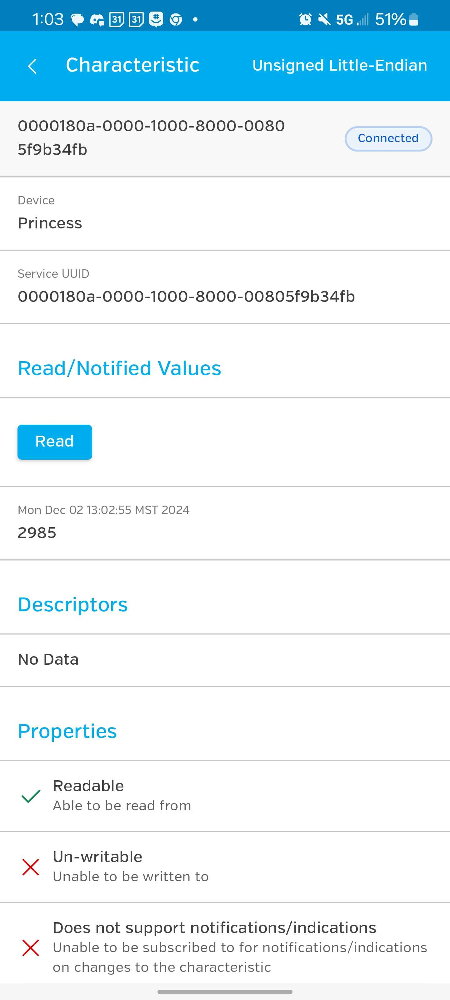

# Lab 11: Andrew Elmir Semrah
YML Status: 

## Adversiting
Here is an image showing our device name showing up correctly:

## Attributes, Services, and Characteristics
Here is an image showing showing GATTY counter showing instead of GATT counter.

## HCI Packet Handling
Here is an image showing our terminal correctly handling HCI packets.

## Service
Here are the images of our service sending the temperature back.

Thanks to Logan for using his android device to get the updated services info.
